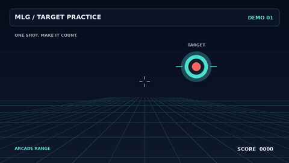
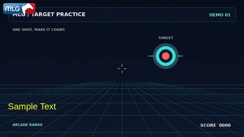

# major-league-gaming

Turn a video into a 2014 MLG montage.

MW2 quickscopes, slow-motion replays, hitmarkers, airhorns, a dubstep drop,
far too many Doritos, and a “deal with it” outro.

## Before and after

Same clip, before and after. The previews are silent; open the after video for
the full thing with sound.

| Before · 8 seconds | After · 19 seconds |
| --- | --- |
| [](demo/target_practice.mp4) | [](demo/demo_MLG.mp4) |

[Before MP4](https://raw.githubusercontent.com/WillMatthews/mlg/main/demo/target_practice.mp4)
· [After MP4 with sound](https://raw.githubusercontent.com/WillMatthews/mlg/main/demo/demo_MLG.mp4)
· [Recreate the demo](demo/README.md)

## Usage

You'll need Python 3.12+, `uv`, and FFmpeg (`ffmpeg` and `ffprobe` on your PATH).
The images and soundbites are included in the repo.

```sh
git clone https://github.com/WillMatthews/mlg.git
cd mlg
uv run mlg clip.mp4
```

This writes `clip_MLG.mp4`. By default, the loudest point in the clip becomes
the shot. Pick a moment yourself with `-m` (seconds):

```sh
uv run mlg clip.mp4 -m 4.2 --target 0.4,0.3
```

`--target` sets where the scope aims and the shades land. Coordinates run from
`0,0` at the top left to `1,1` at the bottom right; the default is `0.5,0.5`.

To try the included demo:

```sh
uv run mlg demo/target_practice.mp4 -m 3.2
```

## Bring your own drop

Without a track, `mlg` generates a 140 BPM wobble drop. Use `--drop` to supply
your own, `--drop-start` to choose where it kicks in, and `--bpm` to sync the effects:

```sh
uv run mlg clip.mp4 --drop bangarang.mp3 --drop-start 31.5 --bpm 110
```

`--drop-len` sets how many seconds to use (default: 8). You can also put a track
at `sounds/drop.mp3` to use it by default.

Run `uv run mlg --help` for output path, width, seed, and other options.

## Swap the memes

Replace files in [sounds/](sounds) or [assets/](assets), keeping their names.
For example, `sounds/airhorn.mp3` changes the horn and `assets/doritos.png`
changes the falling snacks. Sounds can also be WAV, OGG, FLAC, or M4A.
Missing sounds and sprites use generated fallbacks where available.

Snoop, the frog, and the quickscope use animation frames in `assets/snoop/`,
`assets/frog/`, and `assets/quickscope/`.

To fetch the source assets again, run `./fetch_assets.sh` (requires `curl`;
`yt-dlp` is needed for the quickscope video). To rebuild images and animation
frames from files already in `assets/raw/`, run `uv run python -m mlg.prep`.

## Credits

Soundbites from myinstants.com. Images from pngimg.com, pngkey.com, pngitem.com,
and tenor.com. The MW2 sniper reticle comes from the Call of Duty wiki; the
quickscope green screen is YouTube video `xVrayfJ_oI8`.

Third-party meme material used for parody. The demo's target animation is
generated by [demo/make_source.py](demo/make_source.py).
